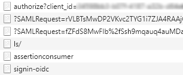

# Get started with DNV.OAuth.Web 

DNV.OAuth.Web is a .NETCore library for developers to simplify the work of setting up OpenId Connection authentication (OIDC) such as Veracity or Azure AD B2C for ASP.NET Core web project.

Below samples will show you how to do authentication through Veracity.

---
# Prerequisites

Please create an App resource in Veracity developer (https://developer.veracity.com/) and copy out the client id and client secret for the use in further steps below. Please follow the tutorials from here: https://developer.veracity.com/docs/section/developerexperience/introduction.

---

# Package Install

Ensure you have configured to package NuGet Package Source or find the instructions [here](PackageInstall.md).


Package Manager Console

```
PM> `Install-Package DNV.OAuth.Web`
```

---

# Basic Authentication Usage

To simplify your authentication implementation of Veracity for your .Net 6+ web project, you need to add 3 blocks of codes to `Startup.cs`.

1. Add namespace reference. 

```csharp
using DNV.OAuth.Web;
```

2. Add `AddOidc` extension method to `ConfigureServices`.
```csharp
public void ConfigureServices(IServiceCollection services)
{
	...
	var oidcOptions = new OidcOptions
	{
		Authority = "<Authority>",
		ClientId = "<ClientId>",
		Scopes = new[] { "<Scope>" },
	};
	services.AddOidc(oidcOptions);
	...
}
```

3. Add `UseAuthentication` and `UseAuthorization` extension methods to `Configure`.
```csharp
public void Configure(IApplicationBuilder app, IWebHostEnvironment env)
{
	...
	app.UseAuthentication().UseAuthorization();
	...
}
```

4. Then you could launch your project and access an action in a controller that decorated with `[Authorize]`, a challenge request will be sent to IDP(Microsoft or Veracity) to start the authentication process, and the `HttpContext` will be filled with authentication result. 



5. A sample project is ready for you to try out: [OidcOAuthSample](https://github.com/veracity-engineering/SolutionPackageDoc/tree/master/samples/OAuth/OidcOAuthSample).

---

# Access Token Cache Usage

If you web project act as an API gateway, you will want to cache users' access tokens to prevent unnecessary token requests. The library uses `MSAL (Microsoft Authentication Library)` to manipulate tokens.

1. Authorization code flow needs to be set to acquire access token, and refresh token is required for MSAL to re-acquire token from IDP if the token exceed its expiration.

```csharp
public void ConfigureServices(IServiceCollection services)
{
	...
	var oidcOptions = new OidcOptions
	{
		Authority = "<Authority>",
		ClientId = "<ClientId>",
		ClientSecret = "<ClientSecret>",
		Resource = "<Resource>",
		Scopes = new[] { "<Scope>", "offline_access" },	// offline_access is required to retrieve refresh_token.
		ResponseType = OpenIdConnectResponseType.Code
	};
	...
}
```

2. To cache the tokens, an implementaion of `IDistributedCache` such as `MemoryDistributedCache` needs to be added.

```csharp
public void ConfigureServices(IServiceCollection services)
{
	...
	services.AddDistributedMemoryCache();
	...
}
```

You can also add `RedisCache` instead.

```csharp
public void ConfigureServices(IServiceCollection services)
{
	...
	services.AddDistributedRedisCache(o =>
	{
		o.InstanceName = "<InstanceName>";
		o.Configuration = "<Configuration>";
	});
	...
}
```

3. Don't forget to add `AddOidc` after what you did previously.

```csharp
public void ConfigureServices(IServiceCollection services)
{
	...
	services.AddOidc(oidcOptions);
	...
}
```

4. Add `UseAuthentication` and `UseAuthorization` extension methods to `Configure`.
```csharp
public void Configure(IApplicationBuilder app, IWebHostEnvironment env)
{
	...
	app.UseAuthentication().UseAuthorization();
	...
}
```

5. A sample project is ready for you to try out: [TokenCacheSample](https://github.com/veracity-engineering/SolutionPackageDoc/tree/master/samples/TokenCacheSample).

---
# Authorize Api with a specific JWT scheme 

1. Create two Api resources (tick the checkbox "This is an API") in Veracity developer and copy out the client ids. Then for both Apis, add client application using the client id you created in the beginning. 

2. Add the JWT options with two authentication themes in appsettings.json
```csharp
"JwtOptions": {
	"App1": {
		"AuthorizationPolicyName": "Policy1",
		"Authority": "<Authority>",
		"ClientId": "<client id of Api 1>"
	},
	"App2": {
		"AuthorizationPolicyName": "Policy2",
		"Authority": "<Authority>",
		"ClientId": "<client id of Api 2>"
	}
}
```

3. Configure services to use JWT options
```csharp
services.AddJwt(this.Configuration.GetSection("JwtOptions").GetChildren());
```

4. Create controller authorized by JWT authentication theme
```csharp
[ApiController]
[Route("api/[controller]")]
public class TestController : ControllerBase
{
	/// <summary>
	/// requires token from App1
	/// </summary>
	/// <returns></returns>
	[HttpGet("mobile")]
	[Authorize(AuthenticationSchemes = "App1")]
	public IEnumerable<KeyValuePair<string, string>> GetMobileClaims()
	{
		return this.User.Claims.Select(c => new KeyValuePair<string, string>(c.Type, c.Value));
	}

	/// <summary>
	/// requires token from App2
	/// </summary>
	/// <returns></returns>
	[HttpGet("janus")]
	[Authorize(AuthenticationSchemes = "App2")]
	public IEnumerable<KeyValuePair<string, string>> GetJanusClaims()
	{
		return this.User.Claims.Select(c => new KeyValuePair<string, string>(c.Type, c.Value));
	}
}
```

5. Configure swagger

	a. Add swagger options in appsettings.json
```csharp
"SwaggerOptions": {
	"Enabled": true,
	"Version": "v1",
	"DocumentTitle": "Demo API",
	"ClientId": "<put your client id here>",
	"ClientSecret": "<put your client secret here>",
	"AuthCodeFlow": {
		"AuthorizationUrl": "<Authorization url>",
		"TokenUrl": "<Token url>",
		"Scopes": {
			"App1": "<scope for App 1>",
			"App2": "<scope for App 2>"
		}
	},
	"ClientCredsFlow": {
		"AuthorizationUrl": "<Authorization url>",
		"TokenUrl": "<Token url>",
		"Scopes": {
			"App1": "<scope for App 1>",
			"App2": "<scope for App 2>"
		}
	}
}
```

6. Add the code snippet below to your Start.cs file
	
```csharp
// ConfigureServices
services.AddSwagger(o => this.Configuration.Bind("SwaggerOptions", o));
```

```csharp
//Configure
app.UseSwaggerWithUI(o => this.Configuration.Bind("SwaggerOptions", o));
```

7. Verify the authentication
Run the program and go to the swagger page, obtain the token through the authorization button by providing the client id/secrets of the app created in the beginning. Then you can execute the Api request in TestController and (hopefully) get a 200 Ok response, which means that the authorization worked as intended. Please select the correct scope aligned with the authentication theme when test the api.

8. A sample project is ready for you to try out: [DemoSample](https://github.com/veracity-engineering/SolutionPackageDoc/tree/master/samples/DNV.OAuth.Demo).