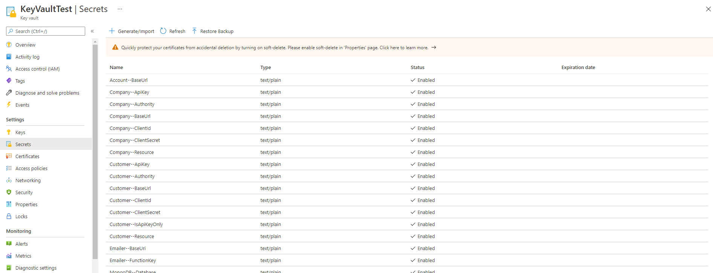

# Secrets Manager
The `DNV.SecretsManager` package is a command line tool for managing secrets from the Azure KeyVault or Azure DevOps Variable Groups.

This tool allows secrets to be downloaded and uploaded as structured JSON files, meaning secrets may be uploaded in structured collections where previously they might have been maintained individually.

## What it does
Given a large collection of key vault secrets in an Azure Key vault such as those shown below:


The secrets manager tool could be executed with a command:

```
secretsmanager keyvault -d -s <keyvault-url> -f output-file.json
```

The resulting `output-file.json` would look like:

```json
{
  "Account": {
    "BaseUrl": <secret value>
  },
  "Company": {
    "ApiKey": <secret value>,
    "Authority": <secret value>,
    "BaseUrl": <secret value>,
    "ClientId": <secret value>,
    "ClientSecret": <secret value>,
    "Resource": <secret value>
  },
  "Customer": {
    "ApiKey": <secret value>,
    "Authority": <secret value>,
    "BaseUrl": <secret value>,
    "ClientId": <secret value>,
    "ClientSecret": <secret value>,
    "IsApiKeyOnly": <secret value>,
    "Resource": <secret value>
  },
  "Emailer": {
    "BaseUri": <secret value>,
    "FunctionKey": <secret value>
  ...
```

Conversely, an input json file (`input-file.json`) could be uploaded to an Azure Key vault by executing a command:

```
secretsmanager keyvault -u -s <keyvault-url> -f input-file.json
```
## Hierachy
The secrets manager assumes a convention where the parent-child relationship between entities in a hierarchy are expressed with a `--` delimeter.

In practice this means: to express that `Company` is the parent of `ApiKey` a key would be named `Company--ApiKey`, if there exists multiple children to a parent they would be aggregated in to a single parent as may be seen in the result above with keys: `Company--ApiKey`, `Company--Authority` and `Company--BaseUrl` etc.  Parent-child relationships may extend to far greater depth than the example given.

## Arrays
It is also possible to include arrays of data in your configuration.  To express a collection of values in an array the indexes should be included explicity declared in place of the child name.  For example, an array may be expressed with a collection of the following keys: `Names--0`, `Names--1`, `Names--2` which would result in the following JSON:

```json
{
	"Names": [
		<secret value>,
		<secret-value>,
		<secret-value>
	]
}
```

---
# Useage

```
secretsmanager   <command> [<args>]

Commands:
        keyvault        Download or upload secrets from/to Azure Keyvault
        variablegroup   Download or upload secrets from/to Azure Keyvault
```

---

## Key vault command

```
secretsmanager keyvault			[-h | --help]
						 		-d | --download -u | --upload | -c | --clear
						 		-s | --url <url>
						 		-f | --filename <filename>
```

### Options
`-h | --help`

Prints the synopsis of commands and options available.

`-d | --download`

Requests the secrets to be downloaded from the specified source to a JSON file.

`-u | --upload`

Requests that a provided JSON file be uploaded to a specified source.

`-c | --clear`

Deletes all secrets from the specified source.

`-s | --url <url>`

Provide the URL to the keyvault.

`-f | --filename <filename>`

Specify the file to which you would like to download to or upload from.

---

## Variable group command
```
secretsmanager variablegroup	[-h | --help]
								-d | --download -u | --upload | -c | --clear
								-s | --base-url <base-url>
								-o | --organization <organization>
								-p | --pat <pat>
								-g | --group-id <group-id>
								-f | --filename <filename>
```
### Options
`-h | --help`

Prints the synopsis of commands and options available.

`-d | --download`

Requests the secrets to be downloaded from the specified source to a JSON file.

`-u | --upload`

Requests that a provided JSON file be uploaded to a specified source.

`-c | --clear`

Deletes all secrets from the specified source.

`-s | --base-url <base-url>`

Provide the base URL to the Azure DevOps.

`-o | --organization <organization>`

Provide the organization under Azure DevOps to which a variable group belongs.

`-p | --pat <pat>`

Specify the Person Access Token for authentication.

`-g | --group-id <group-id>`

Specify the id of the variable group you would like to download from or upload to.

`-f | --filename <filename>`

Specify the file to which you would like to download to or upload from.