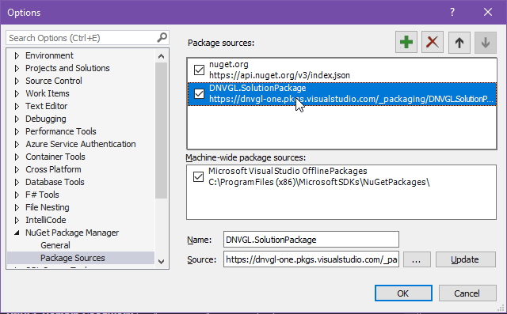

# Package Install
To install any package from the Solution Package collection, the package feed should be included in your nuget package sources:


This may be added in Visual Studio by navigating to **Tools** > **NuGet Package Manager** > **Package Manager Settings**
An **Options** window will appear, select the Package Sources node on the left hand pane the click the  button, provide a Name and enter the Source below:
```
https://dnvgl-one.pkgs.visualstudio.com/_packaging/DNVGL.SolutionPackage/nuget/v3/index.json
```


Click OK to complete.

One done it will be possible to add any of the NuGet packages outlined in this documentation to your projects via the Package Manager in visual studio or via the Package Manager Console.