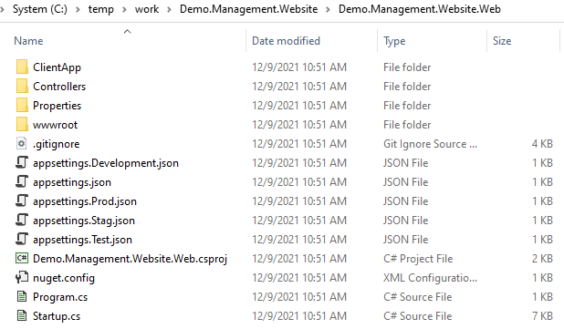

# Introduction to Solution Web Project Templates

Project templates produce ready-to-run projects that make it easy for users to start with a working set of code. .NET includes a few project templates such as a console application or a class library. So we provide a project template to help you initialize web project.   

We don't plan to introduce how to setup a project template via dotnet core cli. If you are interested, please refer [Tutorial: Create a template package](https://docs.microsoft.com/en-us/dotnet/core/tutorials/cli-templates-create-template-package) .

## Introduce templates into dotnet CLI Tools

###### Overview

The `DNV.SolutionPackage.ProjectTemplates` helps developer to quickly initialize a work around web application project. We don't need to take more time on setting up. The developer can focus on business domain development tasks. This template contains authentication with Veracity. If the application need user management, it is also provided. 


###### Install the template package

There are two methods to install SolutionPackage project templates. One is to install it directly from Nuget package source. Other is to install from local file.

```bash
dotnet new -i DNV.SolutionPackage.ProjectTemplates::1.0.0 --nuget-source "https://dnvgl-one.pkgs.visualstudio.com/_packaging/DNVGL.SolutionPackage/nuget/v3/index.json"

dotnet new -i C:\Temp\DNV.SolutionPackage.ProjectTemplates.1.0.0.nupkg
The following template packages will be installed:
   C:\Temp\DNV.SolutionPackage.ProjectTemplates.1.0.0.nupkg

Success: DNV.SolutionPackage.ProjectTemplates::1.0.0 installed the following templates:
Template Name                    Short Name      Language  Tags
-------------------------------  --------------  --------  ----
DNV.SolutionPacakge.WebTemplate  DNVWebTemplate            DNV
```


###### List the templates

```bash
dotnet new --list
```

After the template package installation,  `DNV.SolutionPackages.WebTemplate` is in the templates list. You also can use `dotnet new --list` command to list the detail which templates have installed.

```bash
dotnet new -l
These templates matched your input:

Template Name                                 Short Name           Language    Tags
--------------------------------------------  -------------------  ----------  -------------------------------------
ASP.NET Core Empty                            web                  [C#],F#     Web/Empty
ASP.NET Core gRPC Service                     grpc                 [C#]        Web/gRPC
ASP.NET Core Web API                          webapi               [C#],F#     Web/WebAPI
ASP.NET Core Web App                          webapp,razor         [C#]        Web/MVC/Razor Pages
ASP.NET Core Web App (Model-View-Controller)  mvc                  [C#],F#     Web/MVC
ASP.NET Core with Angular                     angular              [C#]        Web/MVC/SPA
ASP.NET Core with React.js                    react                [C#]        Web/MVC/SPA
ASP.NET Core with React.js and Redux          reactredux           [C#]        Web/MVC/SPA
Blazor Server App                             blazorserver         [C#]        Web/Blazor
Blazor WebAssembly App                        blazorwasm           [C#]        Web/Blazor/WebAssembly/PWA
Class Library                                 classlib             [C#],F#,VB  Common/Library
Console App                                   console              [C#],F#,VB  Common/Console
DNV.SolutionPacakge.WebTemplate               DNVWebTemplate                   DNV
dotnet gitignore file                         gitignore                        Config
...
```

There are some built-in template packages, also you see our `DNV.SolutionPackage.WebTemplate` in the list.


###### Uninstall the template package

The `dotnet new --uninstall` command can remove the template.

```bash
dotnet new --uninstall DNV.SolutionPackage.ProjectTemplates

dotnet new -u DNV.SolutionPackage.ProjectTemplates
Success: DNV.SolutionPackage.ProjectTemplates::1.0.0 was uninstalled.
```


### Create project via Solution Package project templates

Let's take a look the functions of `DNV.SolutionPackage.WebTemplate`. The  `dotnet new DNVWebTemplate --help` command list all the parameters. 

```bash
dotnet new DNVWebTemplate --help
DNV.SolutionPacakge.WebTemplate
Author: Tim Tu
Options:
  -t|--template      The type of webtemplate to use
                         basic         - basic
                         management    - management
                     Default: basic

  -s|--skipRestore   If specified, skips the automatic restore of the project on create.
                     bool - Optional
                     Default: false

  -sk|--skipDBSetup  If specified, skips the DB creation process on create.
                     bool - Optional
                     Default: false
```


The `-t|--template` option chooses main functions will be installed in created project. The `basic` is default value, the created project will integrate authentication library `DNVGL.OAuth.Web` which also is from `DNV.SolutionPackage`.  The `management` option not only has all `basic` functions, but also integrates user management  

The `-s|--skipRestore` option restores the dependencies of the created project. The default value is `false`. Doesn't restore the dependencies after created project. 

The `-sk|--skipDBSetup` option must works with `-t|--template management` option. It will create tables related with user management in local SQL Server database. If there is no SQL Server in your local machine, A folder `Scripts` will be created in solution folder. The `Scripts` folder contains `db.bat` and `dbcreation.sql` files. Use `dbcreeation.sql` to generate tables in specify database.  


The `dotnet new DNVWebTemplate` command create project from `DNV.SolutionPackage.WebTemplate` template.


```bash
dotnet new DNVWebTemplate --template management --name Demo.Management.Website --output ManagementSolution
The template "DNV.SolutionPacakge.WebTemplate" was created successfully.

Processing post-creation actions...
No Primary Outputs to restore.

Template is configured to run the following action:
Actual command: Scripts/db.bat
Do you want to run this action [Y(yes)|N(no)]?
N
```

In the work folder, there are new solution and project files in folder `ManagementSolution`. 




When the website is running, the first access user will be added as administrator. This function is implemented in  `AuthController.cs` file. Please pay attention when you use in your business. 

The front-end of website is SPA application. The source code is in `ClientApp` folder.  Please refer https://webapptemplatedoc.z6.web.core.windows.net/articles/intro.html .
