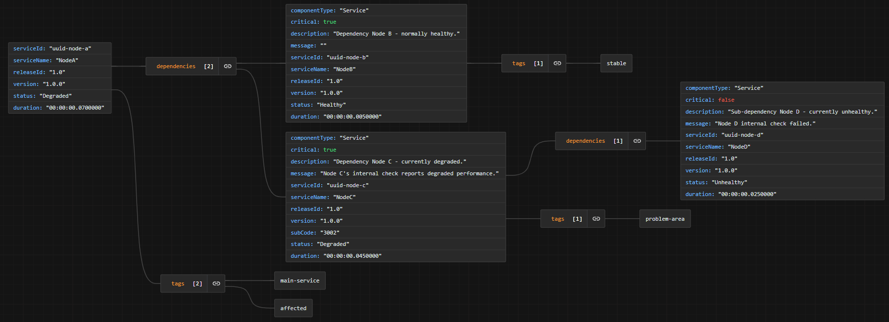

# HealthCheck Package

## What it does?
Provides service level health checks for ASP.NET Core applications, including support for downstream service checks and Veracity-compatible status reporting.


## Who should use it?
Backend developers working with ASP.NET Core services that require health monitoring, especially those integrating with Veracity or using API Management.

## Business value
Improves system reliability and observability by enabling early detection of issues, supporting secure deployments, and integrating with monitoring tools like Veracity Status and Azure Monitor.

## Key Features
- **ServiceHealthCheck**: Checks the downstream services to collect dependency status.
- **VeracityStatus Adapter**: Converts standard health check results into Veracity Status-compatible format for unified monitoring.

## When to Use This Package
✅ **Use when you want to**:
- Return more detailed service information than the default health check response.
- Monitor services that have been moved from public internet to private vNet environments, where standard probes cannot reach.
- Handle cyclic dependencies between services that may block default URI-based health checks.
- Support API Management (APIM) scenarios by allowing the use of subscription keys to access protected endpoints.
- Expose health status in Veracity Status-compatible format.
- Provide custom health check logic with support for degraded and unhealthy states.

❌ **Don't use when**:
- You only need basic liveness or readiness checks without external dependencies.
- Your service does not require integration with Veracity or custom health reporting.
Then better switch to 3rd party library e.g. https://github.com/Xabaril/AspNetCore.Diagnostics.HealthChecks

## Quick Start
### Installation
Download:
- DNV.Monitoring.HealthChecks.VeracityStatus

## Dependencies & Requirements
- **.NET Version**: 6.0
- **Key Dependencies**: Microsoft.AspNetCore.App

## Configuration
```csharp
builder.Services.AddHttpClient();
builder.Services.AddHttpContextAccessor();

builder.Services.AddHealthChecks()
.AddServiceHealthCheck(new ServiceHealthCheckOptions { 
    Uri = "https://localhost:7204/health"
}, “Child Service”);

app.MapVeracityHealthChecks("/health", new VeracityStatusHealthCheckOptions
{
    ServiceId = "0216F707-0772-4A36-A1B9-3923128B45E7",
    ReleaseId = “v1.30",
    Version = "1.5",
    Description = "Parent Service",
});
```
### ServiceHealthCheck

| Option           | Description                                                                 |
|------------------|-----------------------------------------------------------------------------|
| `Uri`     | Downstream service URL.                                                            |
| `HttpMethod`     | Http method to invoke down stream service.                                  |
| `SubscriptionKey`| Provide if service is in API management.                                    |
| `Critical`      | The HealthStatus that should be reported for current service. When the component check fails. If critical is true, the HealthStatus.Unhealthy will be reported, otherwise HealthStatus.Degraded will be reported.  |
| `ComponentType`      | Type of dependency service.                                             |
| `Healthy`        | Function to determine if the HTTP response should be treated as healthy.    |
| `Degraded`       | Function to determine if the HTTP response should be treated as degraded.   |
| `Unhealthy`      | Function to determine if the HTTP response should be treated as unhealthy.  |


### VeracityStatus

| Option        | Description                                                                 |
|---------------|-----------------------------------------------------------------------------|
| `Status`      | Veracity Status accepts status, Pass is healthy, Warn is degraded, Fail is unhealthy. |
| `Duration`    | Duration of the health check execution.                                     |
| `ServiceId`   | Identifies the service, config in developer portal.                         |
| `ReleaseId`   | Internal release Id of the service.                                         |
| `Version`     | Public version of the service.                                              |
| `Description` | Human-friendly description of the service.                                  |
| `Message`     | Default message in human-readable form.                                     |
| `SubCode`     | Defined and set by the team implementing the service. Child status code should not influence parent's status code.                                                                         |
| `Tags`        | Tags to describe the service.                                               |
| `HealthyHttpStatus`        | HealthCheck end point response http status when status is 'Healthy'. Default is 200.                                                                                          |
| `DegradedHttpStatus`        | HealthCheck end point response http status when status is 'Degraded'. Default is 424.                                                                                          |
| `UnhealthyHttpStatus`        | HealthCheck end point response http status when status is 'Unhealthy'. Default is 503.                                                                                          |
| `enrichVeracityStatus`| After all component checks have been executed and the compoents response collected, this delegate will be invoked to update response of the veracity status format. E.g. to generate dynamic error message and subCode.                                                                                      |


## Common Use Cases
### Demo project
https://github.com/veracity-engineering/SolutionPackageDoc/tree/master/samples/HealthCheck ? 


## Troubleshooting
| Problem | Cause | Solution |
|--------|-------|----------|
| Health check endpoint not reachable | Service behind vNet or APIM | Use SubscriptionKey and ensure routing is configured |
| Health check always returns unhealthy | Incorrect evaluation logic | Review Healthy, Degraded, Unhealthy functions |
