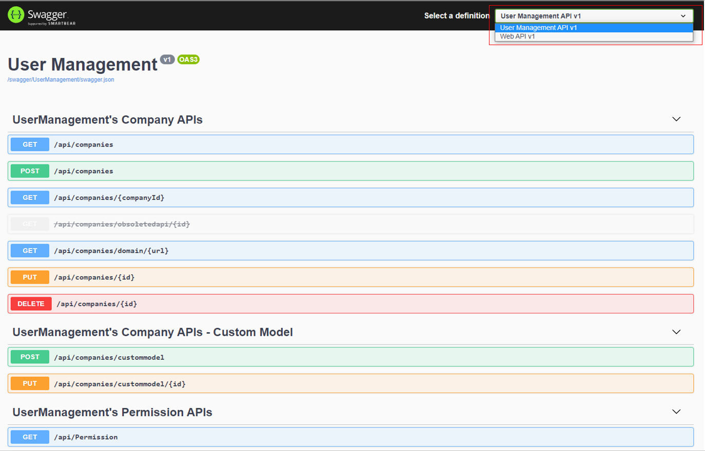

# User Management and Authorization
DNVGL.Authorization.UserManagement.ApiControllers provides restAPIs to manage user, role and company. It also provides mechanisms to authorize API endpoints. Go through [Overview](/articles/userManagement/overview) to understand the logic behind the package. Check out [Demo Projects](https://github.com/HK-Zhang/DNV_UserManagement_Demo).

## Prerequisites
PM> `Install-Package DNVGL.Authorization.UserManagement.ApiControllers`

PM> `Install-Package DNVGL.Authorization.UserManagement.EFCore`

## Basic Usage
This simple example will show you the minimum steps to setup user management and authorization in a ASP.NET Core project. The example uses SQL Server as database and Veracity authentication (Azure AD B2C).
### 1. register user management module in ASP.NET core project.
PM> `Install-Package Microsoft.EntityFrameworkCore.SqlServer`
```cs
    public class Startup
    {
        //...
        public void ConfigureServices(IServiceCollection services)
        {
            //...
            services.AddUserManagement().UseEFCore(new EFCoreOptions
                {
                    DbContextOptionsBuilder = options => options.UseSqlServer(@"Data Source=.\SQLEXPRESS;Initial Catalog=UserManagement;Trusted_Connection=Yes;")
                });
            //...
        }

        public void Configure(IApplicationBuilder app, IWebHostEnvironment env)
        {
            //...
            //Put UseRouting or MapControllers before UseAuthentication and UseAuthorization
            //app.MapControllers();
            app.UseRouting();
            app.UseAuthentication().UseAuthorization();
            //...

            //...
            //The following code is required if app.UseRouting() is used instead of app.MapControllers();
            app.UseEndpoints(endpoints =>
            {
                //...
                endpoints.MapDefaultControllerRoute();
            });

            //...
        }
    }
```
### 2. Create tables in database
Find and execute `NewTableScript.sql` which is located at the content directory once you imported the package in your project.

### 3. Create a super admin in Table - `Users`. 
The following is sample.
| Id | Email | FirstName | LastName | VeracityId | SuperAdmin | Active | Deleted |
|--|--|--|--|--|--|--|--|
| *1* | *email* | *first name* | *last name* | *veracity id* | 1 | 1 | 0

### 4. Generate Swagger api documentation (Optional)
> **_NOTE:_**  This step is optional. You can generate API docs in your own way. The following code has dependency on Nuget package - `Swashbuckle.AspNetCore`. Additionaly, you will get more explanation if you set `apidocs/DNVGL.Authorization.UserManagement.ApiControllers.xml`'s *Copy to Output Directory* as **Copy Always**.

```cs
    public class Startup
    {
        //...
        public void ConfigureServices(IServiceCollection services)
        {
            //...
            services.AddControllers();
            services.AddSwaggerGen(c =>
            {
                // swagger documentaion group for User Management.
                c.SwaggerDoc("UserManagement", new OpenApiInfo
                {
                    Title = "User Management",
                    Version = "v1"
                });

                // swagger documentaion group for your system.
                c.SwaggerDoc("WebAPI", new OpenApiInfo
                {
                    Title = "Web API",
                    Version = "v1"
                });

                c.TagActionsBy(api =>
                {
                    if (api.GroupName != null)
                    {
                        return new[] { api.GroupName };
                    }

                    var controllerActionDescriptor = api.ActionDescriptor as ControllerActionDescriptor;
                    if (controllerActionDescriptor != null)
                    {
                        return new[] { controllerActionDescriptor.ControllerName };
                    }

                    throw new InvalidOperationException("Unable to determine tag for endpoint.");
                });

                c.DocInclusionPredicate((name, api) =>
                {
                    if (name == "UserManagement")
                        return api.GroupName != null && api.GroupName.StartsWith("UserManagement");
                    else
                        return api.GroupName == null;
                });

                var xmlFile = $"DNVGL.Authorization.UserManagement.ApiControllers.xml";
                var xmlPath = Path.Combine(AppContext.BaseDirectory, xmlFile);
                if (File.Exists(xmlPath))
                    c.IncludeXmlComments(xmlPath);
            });
            //...
        }

        //...
        public void Configure(IApplicationBuilder app, IWebHostEnvironment env)
        {
            //...
            app.UseSwagger();
            app.UseSwaggerUI(c =>
            {
                c.SwaggerEndpoint("/swagger/UserManagement/swagger.json", "User Management API v1");
                c.SwaggerEndpoint("/swagger/WebAPI/swagger.json", "Web API v1");
            });
            //...
        }
    }
```

### 5. Explore user management APIs
#### Build and Run your project.
#### Open swagger in Browser



### 6. Define permissions
Define permissions by implementing interface - `IPermissionMatrix`. The following code defined two permissions.
```cs
    public class PermissionBook : IPermissionMatrix
    {
        public enum WeatherPermission
        {
            //...

            [PermissionValue(id: "8", key: "ReadWeather", name: "Read Weather", group: "Weather", description: "ReadWeather")]
            ReadWeather,

            [PermissionValue(id: "8", key: "WriteWeather", name: "Write Weather", group: "Weather", description: "WriteWeather")]
            WriteWeather,

            //... other permissions
        }
    }
```
### 7. Authorize API with permissions
Decorates API actions with permission.
```cs
        [HttpGet]
        [PermissionAuthorize(WeatherPermission.ReadWeather)]
        public IEnumerable<WeatherForecast> Get()
        {
            //... api logic
        }
```

## Recommended content
[**Read First &check; &check; &check;**](/articles/userManagement/overview)
>  Something you need to know before using the package to handle user management and authorization.

[Integration with ASP.NET Core's Role-based authorization &check;](/articles/userManagement/authorize)
>  Integrate user management module with Role-based authorization in ASP.NET Core. In this way, you are allowed to authorize API with asp.net core's `[Authorize(Roles = "****")]`.

## Guidance for different databases
[Use Azure CosmosDB as database](/articles/userManagement/cosmos)

[Use SQL Server as database](/articles/userManagement/sqlserver)

User other databases.
> The package can use all database engines supported by EF Core 5.0+. Here is a list -  [EF Core 5.0 Database providers](https://docs.microsoft.com/en-us/ef/core/providers/?tabs=dotnet-core-cli)

## Guidance for configuration
[User Management Configuration](/articles/userManagement/configuration)

## Guidance for customization
[Extend Data model - Company, Role, User](/articles/userManagement/customModel)

[Replace EF Core with your own data access](/articles/userManagement/dataAccess)

## Guidance for access control &check;
[Resource access control](/articles/userManagement/accessControl) guide you to control access on resource of company.

## Guidance for defining premissions outside souce code
[Define permissions in json, database or other places](/articles/userManagement/permissionStore)