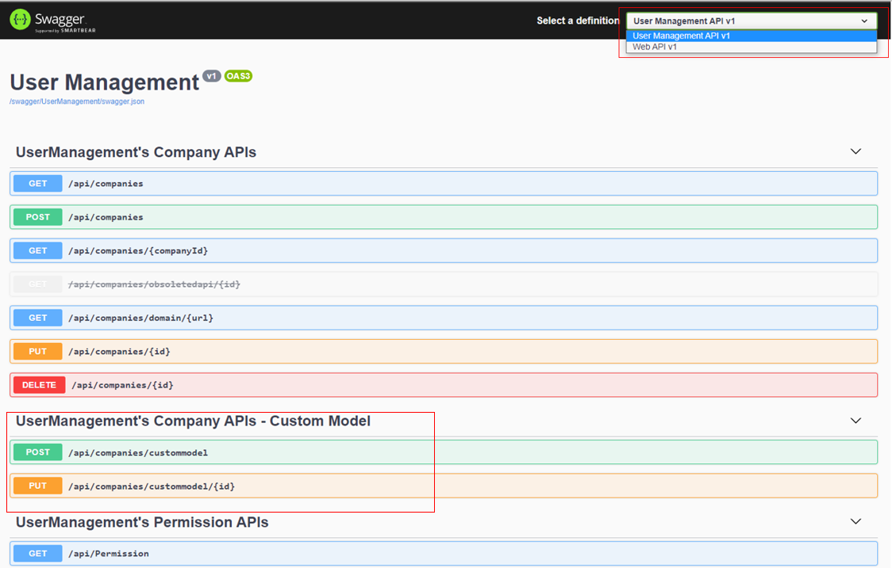

# Customize Data Model
In this section, you learn how to extend data model of `Company`, `Role` and `User` with extra fields to support a project's need.
## Prerequisites
PM> `Install-Package DNVGL.Authorization.UserManagement.Abstraction`

## Extend data models by inheriting from built-in data models
```cs
    public class MyCompany:Company
    {
        public string ExtraCompanyProperty { get; set; }
    }

    public class MyRole : Role
    {
        public string ExtraRoleProperty { get; set; }
    }

    public class MyUser : User
    {
        public string ExtraUserProperty { get; set; }
    }
```

## Register your data models
Only **User** model is customized
```cs
    public class Startup
    {
        //...
        public void ConfigureServices(IServiceCollection services)
        {
            //...
            services.AddUserManagementWithCustomModel<MyUser>().UseEFCore<MyUser>(new EFCoreOptions
            {
                DbContextOptionsBuilder = options => options.UseSqlServer(@"Data Source=.\SQLEXPRESS;Initial Catalog=UserManagement;Trusted_Connection=Yes;")
            });
            //...
        }
    }
```

Both **Company** and **User** model are customized
```cs
    public class Startup
    {
        //...
        public void ConfigureServices(IServiceCollection services)
        {
            //...
            services.AddUserManagementWithCustomModel<MyCompany, MyUser>().UseEFCore<MyCompany, MyUser>(new EFCoreOptions
            {
                DbContextOptionsBuilder = options => options.UseSqlServer(@"Data Source=.\SQLEXPRESS;Initial Catalog=UserManagement;Trusted_Connection=Yes;")
            });
            //...
        }
    }
```

All **Company**, **Role** and **User** model are customized
```cs
    public class Startup
    {
        //...
        public void ConfigureServices(IServiceCollection services)
        {
            //...
            services.AddUserManagementWithCustomModel<MyCompany, MyRole, MyUser>().UseEFCore<MyCompany, MyRole, MyUser>(new EFCoreOptions
            {
                DbContextOptionsBuilder = options => options.UseSqlServer(@"Data Source=.\SQLEXPRESS;Initial Catalog=UserManagement;Trusted_Connection=Yes;")
            });
            //...
        }
    }
```
## API for custom model
> `POST` and `PUT` api endpoints are different between built-in model and custom model. The following the API for custom model.

| Path | HTTP Action |
|--|--|
| /api/companies/custommodel | POST |
| /api/companies/custommodel/{id} | PUT |
| /api/company/{companyId}/roles/custommodel | POST |
| /api/company/{companyId}/roles/custommodel/{id} | PUT |
| /api/company/{companyId}/users/custommodel | POST |
| /api/company/{companyId}/users/custommodel/{id} | PUT |
| /api/admin/users/custommodel | POST |
| /api/admin/users/custommodel/{id} | PUT |

