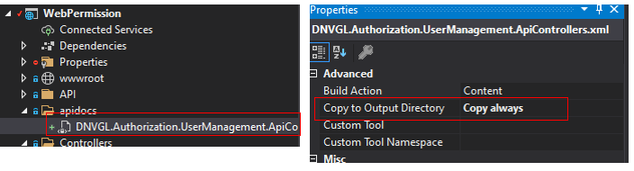
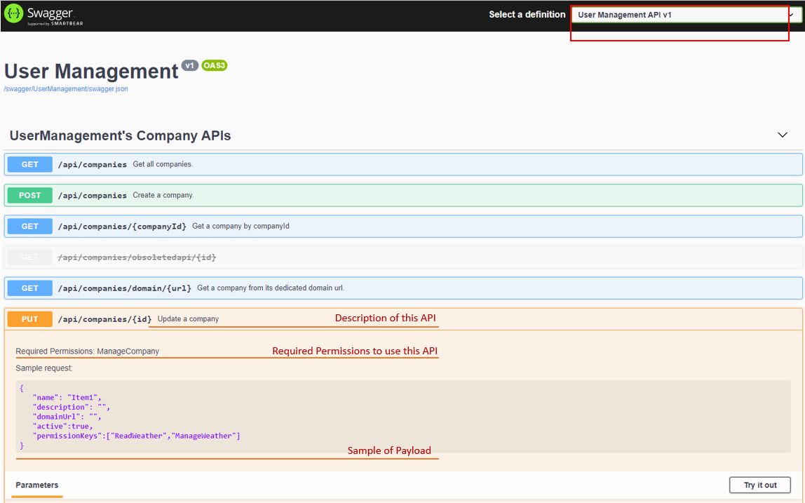

# APIs documentation with Swagger
In this section, you learn how to expose User Management APIs documentaion in Swagger UI. By default, they are probably not shown in Swagger UI. Then you could follow below instructuon to get it displayed on Swagger UI.

## Prerequisites
PM> `Swashbuckle.AspNetCore`

## Configure swagger in `Startup.cs`
It will serperate User Management APIs from your project APIs.
```cs
    public class Startup
    {
        //...
        public void ConfigureServices(IServiceCollection services)
        {
            //...
            services.AddControllers();
            services.AddSwaggerGen(c =>
            {
                // swagger documentaion group for User Management.
                c.SwaggerDoc("UserManagement", new OpenApiInfo
                {
                    Title = "User Management",
                    Version = "v1"
                });

                // swagger documentaion group for your system.
                c.SwaggerDoc("WebAPI", new OpenApiInfo
                {
                    Title = "Web API",
                    Version = "v1"
                });

                c.TagActionsBy(api =>
                {
                    if (api.GroupName != null)
                    {
                        return new[] { api.GroupName };
                    }

                    var controllerActionDescriptor = api.ActionDescriptor as ControllerActionDescriptor;
                    if (controllerActionDescriptor != null)
                    {
                        return new[] { controllerActionDescriptor.ControllerName };
                    }

                    throw new InvalidOperationException("Unable to determine tag for endpoint.");
                });

                c.DocInclusionPredicate((name, api) =>
                {
                    if (name == "UserManagement")
                        return api.GroupName != null && api.GroupName.StartsWith("UserManagement");
                    else
                        return api.GroupName == null;
                });

                var xmlFile = $"DNVGL.Authorization.UserManagement.ApiControllers.xml";
                var xmlPath = Path.Combine(AppContext.BaseDirectory, xmlFile);
                if (File.Exists(xmlPath))
                    c.IncludeXmlComments(xmlPath);
            });
            //...
        }

        //...
        public void Configure(IApplicationBuilder app, IWebHostEnvironment env)
        {
            //...
            app.UseSwagger();
            app.UseSwaggerUI(c =>
            {
                c.SwaggerEndpoint("/swagger/UserManagement/swagger.json", "User Management API v1");
                c.SwaggerEndpoint("/swagger/WebAPI/swagger.json", "Web API v1");
            });
            //...
        }
    }
```

## Copy document to output (optional)
It is an optionanl step. With this step, more infomation will shown on the Swagger UI. otherwise, only API endpoints are displayed on Swagger UI.



## Open swagger in Browser
By default, the link to open swagger is the [HOST]/swagger. Then choose User Management API from definition drowdown list.
